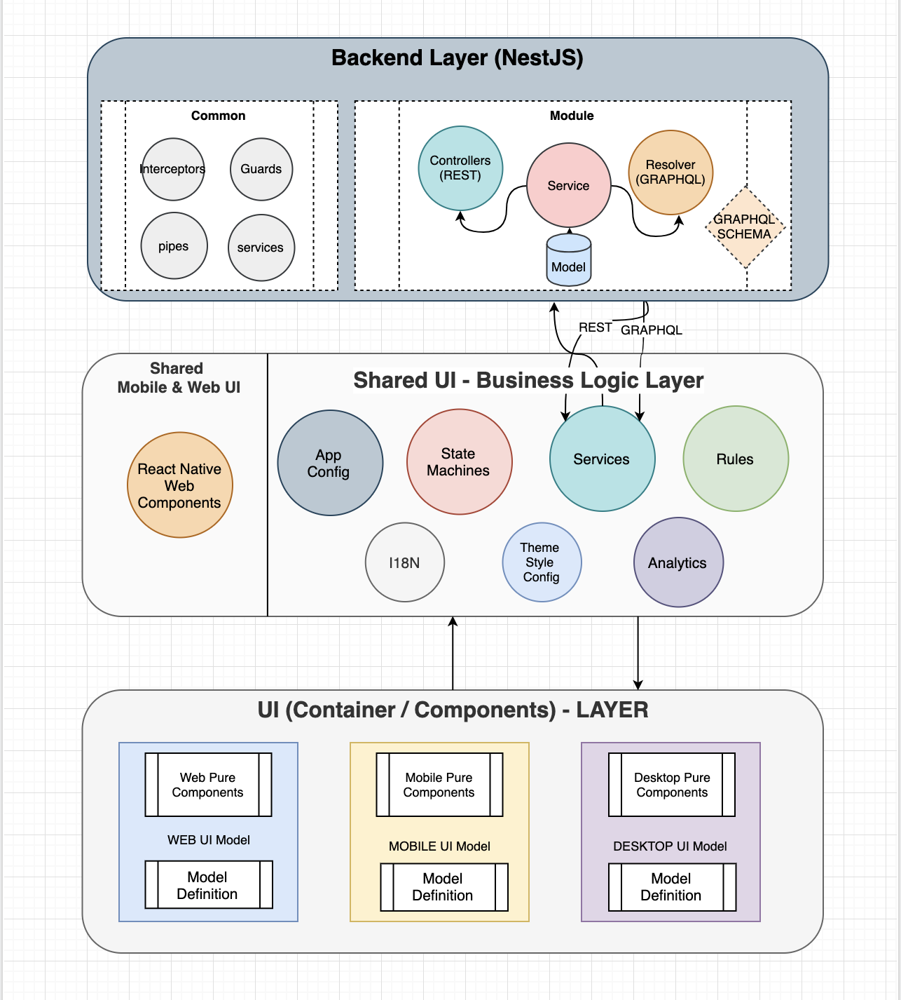

# React (SSR) Advanced Seed

- NestJS + React (SSR) + React Native + REST / GraphQL
- Service workers Integration (Offline First - Push Notifications - PWA)
- NGINX - Reverse proxy integration to route to multiple api's via same origin (Docker links)  
- Dockerized Containers for frontend and backend using docker compose
- Babel 7, Webpack 4, Eslint 5, Typescript, Prettier, Jest 24 integration with HMR for both web and mobile (React Native - metro)
- Fastlane integration for mobile (React Native) to deploy to Testflight / Appstore (iOS) and PlayStore / Internal test track (Android) using Continous Integration (Eg: Azure, Jenkins, Bitrise, etc).

## (Work In Progress)

## [](https://app.netlify.com/sites/confident-mestorf-ab8ce9/deploys) [](https://app.bitrise.io/app/d98e7b1dcb54c9ac) [](https://dev.azure.com/github0586/react-ssr-advanced/_build/latest?definitionId=1&branchName=master) [](https://circleci.com/gh/vip-git/react-ssr-advanced-seed) [](https://codecov.io/gh/vip-git/react-ssr-advanced-seed)

## [](https://badge.fury.io/js/npm) [](https://david-dm.org/vip-git/react-ssr-advanced-seed) [](https://david-dm.org/vip-git/react-ssr-advanced-seed)

### Prerequisites

- [Node.js 8.0+](http://nodejs.org)

### Generic Architecture


### Getting Started

```
npm install

npm start (This will start both frontend and backend servers for you)

Visit:
- http://localhost:8500 (FrontEnd with HMR)
- http://localhost:3000 (Backend running NestJS)
- http://localhost:3000/graphql (Graphql server running graphQL playground theme)
- http://localhost:3000/swagger (running Swagger UI)
```

### Production Build with docker compose (Client and Server) (Frontend, Backend and Postgres)

```
npm run build
```

Visit: http://localhost:8080

### Mobile Build

```
npm run install:mobile (Install mobile dependencies)

Packager: npm run start:mobile

ios: npm run mobile:ios
android: npm run mobile:android
```

### Kubernetes Deployment

```
kubectl create -f deployment.yml
```

### DockerHub Image

```
- https://hub.docker.com/r/vipgit/react-ssr-nginx/

docker run -d -v /root/.ssh/ -v /opt/node-advanced-app vipgit/react-ssr-nginx:latest
```

### Testing (Unit and End to End Testing)

```
npm run test (Runs Backend Unit Tests)
npm run test:frontend (Runs Frontend Unit Tests)
npm run test:e2e (Runs Frontend End to End Tests)
```

## Auto-Generated DOCS
- Coming Soon
